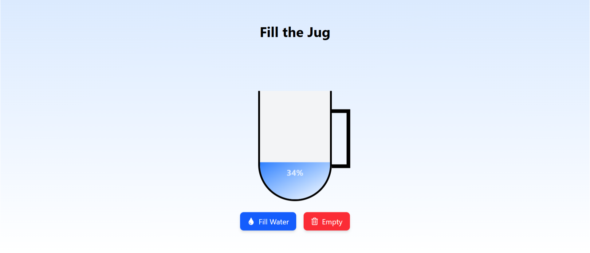

# Fill the Jug 🏺
You will often find a problem like this asked to you by the interviewr. Under the hood, solution of these problems are built upon the simple fundamental knowledge of React. 

Let's understand the `Fill the Jug` problem.

## The Problem Statement
Achieve the followings with a ReactJS project.

- Create a Jug(mug or container) that can hold water in it. Create two buttons to fill and empty the water from the jug.
- Everytime you fill or empty the water, it should show the % of the water filled in the jug.
- Once the water level reaches 100%, you shouldn't be allowed to fill more water to the jug. Do not disable the fill button in this case.
- Once the water level reaches 0%, you shouldn't be allowed to empty more water from the jug. Do not disable the empty button in this case.
- Everytime you fill and empty water, a basic wave animation should be added to the water. The animation should be stopped after 3 seconds and start again next time when you fill and empty the water.

## Expectations
- Clean code
- No unused state
- No unnecessary effects
- No unused imports
- The aesthetics of the jug, water, and button is not important. However, it is desirable.

## Solution
Here is the full length video explains the solution:

[]
